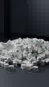
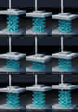
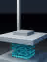

# Falling Dice + Nonlinear Metamaterial Compression

A browsable C++20 research repository containing the maintained **1,000-die rigid-body/rendering project** and the rebuilt **nonlinear beam-lattice compression solver**.

The source is committed directly under `projects/`; the images and playable MP4 previews below are committed under [`media/`](media/).

## Falling dice

[**▶ Play the C++ falling-dice preview (MP4)**](media/falling-dice-preview.mp4)

[](media/falling-dice-preview.mp4)



Source: [`projects/falling-dice/current`](projects/falling-dice/current)

Core implementation:

- [`src/sim.cpp`](projects/falling-dice/current/src/sim.cpp) — dense rigid-body/contact simulation
- [`src/render.cpp`](projects/falling-dice/current/src/render.cpp) — custom CPU rendering/path-tracing pipeline
- [`src/main.cpp`](projects/falling-dice/current/src/main.cpp) — cache, CLI, orchestration, and outputs
- [`tools/validate_scene.py`](projects/falling-dice/current/tools/validate_scene.py) — collider/renderer scene audit

## Nonlinear metamaterial compression

[**▶ Play the load/unload compression preview (MP4)**](media/metamaterial-compression-v2.mp4)

[](media/metamaterial-compression-v2.mp4)

### Deformation, response, and convergence

| Buckled graded lattice | Force–displacement hysteresis |
|---|---|
|  |  |


Source: [`projects/metamaterial-compression/industry-grade`](projects/metamaterial-compression/industry-grade)

The current implementation replaces the earlier point-mass/XPBD prototype with:

- Six mechanical degrees of freedom per lattice node
- Geometrically nonlinear axial, shear, bending, and torsional beam energy
- Incremental elastoplastic state evolution and damage
- Beam self-contact and rigid platen contact
- Incremental quasi-static equilibrium with L-BFGS and safeguarded line search
- Loading and unloading with direct platen-reaction extraction
- Energy, specific-energy-absorption, efficiency, and permanent-set metrics
- Objectivity, finite-difference gradient, convergence, and penetration checks
- A custom CPU capsule/sphere path tracer
- Watertight implicit-union STL export

Key files:

- [`src/sim.cpp`](projects/metamaterial-compression/industry-grade/src/sim.cpp) — nonlinear mechanics, contact, plasticity, and solve loop
- [`src/render.cpp`](projects/metamaterial-compression/industry-grade/src/render.cpp) — C++ visualization renderer
- [`src/main.cpp`](projects/metamaterial-compression/industry-grade/src/main.cpp) — CLI, validation, cache, and manufacturing export
- [`docs/NUMERICAL_METHOD.md`](projects/metamaterial-compression/industry-grade/docs/NUMERICAL_METHOD.md)
- [`docs/VALIDATION.md`](projects/metamaterial-compression/industry-grade/docs/VALIDATION.md)
- [`docs/MATERIAL_CALIBRATION.md`](projects/metamaterial-compression/industry-grade/docs/MATERIAL_CALIBRATION.md)
- [`docs/PRINTING.md`](projects/metamaterial-compression/industry-grade/docs/PRINTING.md)

## Media manifest

Every README link above is relative to this repository and resolves to a committed file:

| Asset | Path |
|---|---|
| Falling-dice MP4 | [`media/falling-dice-preview.mp4`](media/falling-dice-preview.mp4) |
| Falling-dice contact sheet | [`media/falling-dice-contact.jpg`](media/falling-dice-contact.jpg) |
| Falling-dice final frame | [`media/falling-dice-final.jpg`](media/falling-dice-final.jpg) |
| Compression MP4 | [`media/metamaterial-compression-v2.mp4`](media/metamaterial-compression-v2.mp4) |
| Compression contact sheet | [`media/metamaterial-compression-v2-contact.jpg`](media/metamaterial-compression-v2-contact.jpg) |
| Buckling frame | [`media/metamaterial-compression-v2-buckling.jpg`](media/metamaterial-compression-v2-buckling.jpg) |
| Force curve | [`media/metamaterial-compression-v2-force.jpg`](media/metamaterial-compression-v2-force.jpg) |
| Convergence plot | [`media/metamaterial-compression-v2-convergence.jpg`](media/metamaterial-compression-v2-convergence.jpg) |

## Build

```bash
cmake -S . -B build -DCMAKE_BUILD_TYPE=Release -DBUILD_TESTING=ON
cmake --build build --config Release -j
ctest --test-dir build --output-on-failure
```

Run numerical validation:

```bash
./build/projects/metamaterial-compression/metamaterial_compression \
  --mode validate --quick --output validation
```

Run a compression simulation:

```bash
./build/projects/metamaterial-compression/metamaterial_compression \
  --mode sim --output output/metamaterial
```

## Engineering boundary

This is an engineering research codebase, not a certified material model. The nonlinear architecture, contact pipeline, manufacturing exporter, and numerical tests are implemented; physical prediction still requires calibration to the exact material, printer, orientation, temperature, strain rate, friction, and failure behavior.

See [`docs/PROJECT_STATUS.md`](docs/PROJECT_STATUS.md).

## License

MIT.
